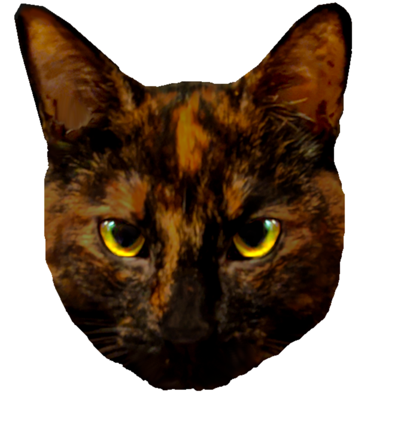
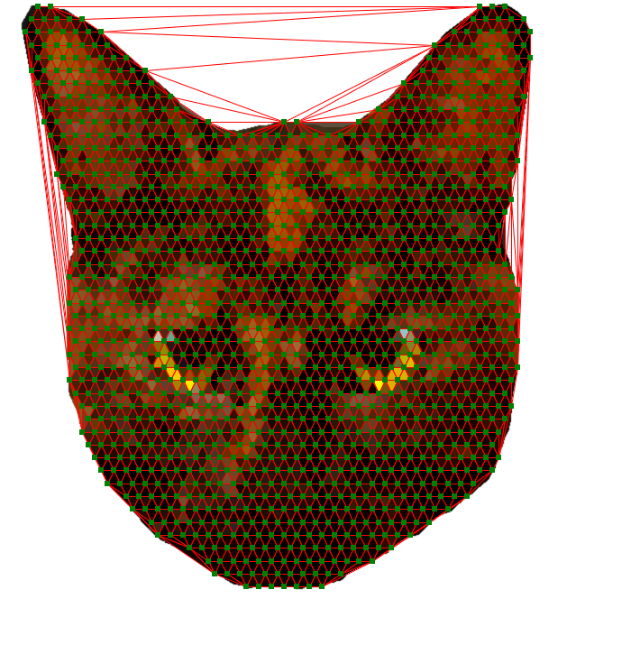
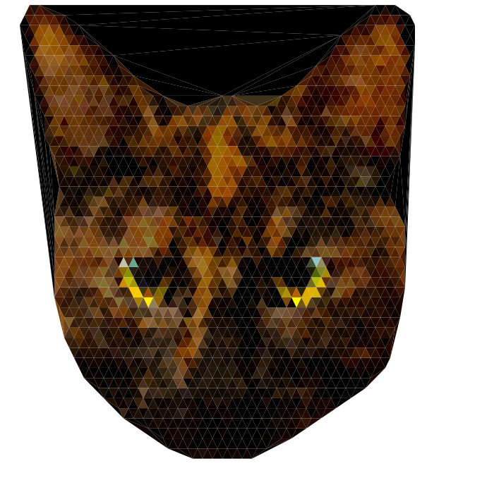

# Triangulationizer

This at the moment is a very rough simple script that takes a png image as input, and runs delaunay triangulation on it to make a bunch of triangles, and then turns that into an svg. The idea being you can generate "low-poly" images from simple pngs. Got a lot of stuff to improve here but the basic idea is implemented.

## Things to improve
- [ ] The generation of points should be randomized a bit and look less uniform, ideally if it was intelligent in some way that'd be good.
- [ ] As you can see below im currently not deleting triangles that are outside of the non-transparent part of the image. That'd be good to do
- [ ] Ideally having points along the outer edges of the non-transparent part could make for a shape that was more conforming to the original image
- [ ] Colors for each triangle are currently grabbed from the pixel in the center of that triangle. We should find a way to average the pixels within that triangle
- [ ] Maybe even more color options somehow?
- [ ] Additional svg generation options?
- [ ] Make a thing to automatically mirror one side to the other, optionally with/without color
- [ ] Give all the paths/triangles a separate id
- [ ] Maybe a way to do intelligent grouping for animations?

## Usage

Super basic inputs at the moment. Currently it will use "example.png" as the input image. Just do `npm install` to install the required dependencies, and then `node process.js` to run the script. There are some parameters you can tweak at the top of the script if you want.

## Example

input image:

generated triangles:

output svg:

